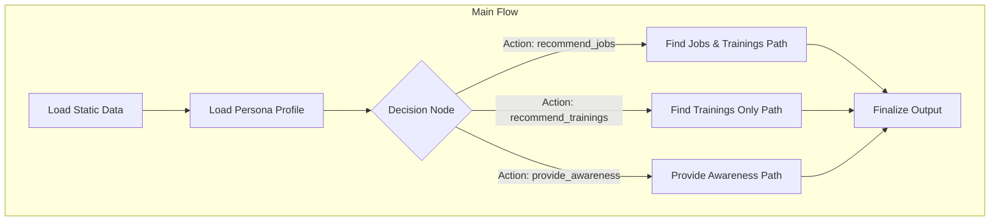

# Design Doc: Green Agents of Change Assistant

> Please DON'T remove notes for AI

## 1. Requirements

> Notes for AI: Keep it simple and clear. If the requirements are abstract, write concrete user stories.

The primary goal is to build an AI-powered agentic system that provides personalized guidance on green jobs and learning opportunities to young people in Brazil. The system will interact with simulated personas, analyze their profiles, and deliver one of three distinct types of recommendations.

### User Stories

*   **Job Seeker:** "As a 22-year-old recent graduate with some marketing skills, I want to find green marketing jobs that I'm a good fit for. If I have skill gaps, I want the assistant to tell me exactly which training courses I should take to become a perfect candidate."
*   **Student/Learner:** "As a 19-year-old student interested in renewable energy, I'm not ready for a job yet. I want the assistant to recommend the best foundational training courses to help me start my learning journey."
*   **Curious Explorer:** "As a 17-year-old, I want to learn what 'green jobs' are and what kind of opportunities exist in general, without committing to a specific path."
*   **Young Inquirer:** "As a 14-year-old, I'm too young to work, but I want to know what I can learn about to help the environment in the future."

### Core Functionality

1.  **Recommend Jobs + Trainings:** For personas ready for employment, identify compatible jobs by applying hard filters and a 70% skill coverage threshold. For each compatible job, identify skill gaps and recommend specific, sequential training programs to fill them.
2.  **Recommend Trainings Only:** For personas focused on upskilling, recommend relevant training courses. The recommendations must follow a strict progression, suggesting only the immediate next level of training (e.g., recommend "Intermediário" if the persona has "Básico").
3.  **Provide Awareness Content:** For personas under 16 years old, classify them as `"too_young"`. For personas seeking general information without a clear goal, classify them as `"info"`. No jobs or trainings are recommended in this case.

## 2. Flow Design

> Notes for AI:
> 1. Consider the design patterns of agent, map-reduce, rag, and workflow. Apply them if they fit.
> 2. Present a concise, high-level description of the workflow.

### Applicable Design Pattern:

We will use a **Workflow** design pattern as the primary structure to ensure a clear, step-by-step process for handling each persona. Within this workflow, the `DecisionNode` will act as a simple, rule-based **Agent**, directing the flow based on the persona's profile. This avoids LLM overhead for initial classification, aligning with the "Green Solution" efficiency goal.

### Flow High-Level Design:

The system will operate in a pipeline for each persona:
1.  **Load Static Data**: Initially, load all job and training data from the local markdown files into memory. This is a one-time setup step.
2.  **Load Persona**: For a given persona ID, load their specific profile.
3.  **Decision**: Analyze the persona's profile (especially age and `expected_output_type`) to determine which of the three main paths to take: `jobs+trainings`, `trainings_only`, or `awareness`.
4.  **Execution**: Branch to the appropriate path to perform the detailed matching and recommendation logic.
5.  **Finalize**: Format the results into the required JSON structure for output.



## 3. Utility Functions

> Notes for AI:
> 1. Understand the utility function definition thoroughly by reviewing the doc.
> 2. Include only the necessary utility functions, based on nodes in the flow.

1.  **Mistral LLM Caller** (`src/utils/call_llm.py`)
    *   **Input**: `prompt` (str), `messages` (list of dicts for history)
    *   **Output**: `response` (str)
    *   **Necessity**: Will be used by nodes that require natural language understanding, such as interpreting a persona's `reason_for_consult` if the `expected_output_type` is not sufficient. Initially, it may not be used by the core decision logic to save tokens.

2.  **Data Retrieval** (`src/utils/data_retrieval.py`)
    *   `load_all_data(path, file_type)`
        *   **Input**: Directory path (e.g., `./data/jobs`), file type ('jobs' or 'trainings').
        *   **Output**: A list of dictionaries, where each dictionary represents a job or training.
        *   **Necessity**: To load all job and training data from the local `.md` files into the `shared` store at the start of the flow. This utility will need to parse the markdown files to extract structured data.
    *   `load_persona(persona_id)`
        *   **Input**: `persona_id` (str)
        *   **Output**: A dictionary containing the persona's profile.
        *   **Necessity**: To get the specific user profile for processing. (Note: The implementation will initially load from local files, but the function signature is designed to easily switch to an API call).

3.  **Matching & Filtering Logic** (`src/utils/gdsc_utils.py`)
    *   `apply_hard_filters(persona, jobs)`
        *   **Input**: `persona` (dict), `jobs` (list of dicts).
        *   **Output**: A filtered list of job dictionaries that pass all hard filter criteria.
        *   **Necessity**: Core logic for the "jobs+trainings" path.
    *   `calculate_skill_coverage(persona, job)`
        *   **Input**: `persona` (dict), `job` (dict).
        *   **Output**: `coverage` (float, e.g., 0.8) and `gap_skills` (list of str).
        *   **Necessity**: Core logic for identifying compatible jobs and their skill gaps.

## 4. Data Design

### Shared Store

> Notes for AI: Try to minimize data redundancy.

The shared store is the central in-memory dictionary that allows nodes to communicate. It will be structured as follows:

```python
shared = {
    # Static data loaded once
    "all_jobs": [
        {"id": "job_001", ...}, 
        ...
    ],
    "all_trainings": [
        {"id": "tr_001", ...},
        ...
    ],

    # Per-persona data
    "persona_id": "pers_001",
    "persona_profile": {
        "id": "pers_001",
        "age": 25,
        ...
    },

    # Intermediate results from nodes
    "decision_action": "jobs+trainings", # or "trainings_only", "awareness"
    "filtered_jobs": [
        # list of jobs that passed hard filters
    ],
    "compatible_jobs_with_gaps": [
        # list of jobs with >= 70% coverage and their skill gaps
    ],

    # Final structured output
    "final_recommendation": {
        "persona_id": "pers_001",
        "gold_type": "jobs+trainings", # Determined by the flow
        "items": [
            {"job_id": "job_001", "gap_skills": [...], "trainings": [...]},
        ]
    }
}
```

## 5. Node Design

### Node Steps

> Notes for AI: Carefully decide whether to use Batch/Async Node/Flow. We will start with a regular, synchronous Flow for simplicity.

1.  **LoadStaticDataNode**
    *   **Purpose**: To load all job and training data into the shared store once.
    *   **Type**: Regular
    *   **Steps**:
        *   `prep`: - (No input required from `shared`).
        *   `exec`: Call `data_retrieval.load_all_data()` for both jobs and trainings.
        *   `post`: Write the lists of jobs and trainings to `shared["all_jobs"]` and `shared["all_trainings"]`.

2.  **LoadPersonaNode**
    *   **Purpose**: To load the profile for the specific persona being processed.
    *   **Type**: Regular
    *   **Steps**:
        *   `prep`: Read `shared["persona_id"]`.
        *   `exec`: Call `data_retrieval.load_persona()` with the persona ID.
        *   `post`: Write the resulting persona dictionary to `shared["persona_profile"]`.

3.  **DecisionNode**
    *   **Purpose**: To analyze the persona and decide the main path for the flow.
    *   **Type**: Regular
    *   **Steps**:
        *   `prep`: Read `shared["persona_profile"]`.
        *   `exec`:
            1.  Check `persona['age']`. If `< 16`, return the action `"provide_awareness_young"`.
            2.  Check `persona['expected_output_type']`.
            3.  If `"jobs"` or `"jobs+trainings"`, return `"recommend_jobs"`.
            4.  If `"trainings_only"`, return `"recommend_trainings"`.
            5.  If `"awareness"`, return `"provide_awareness_info"`.
            6.  Return a fallback or default action if none of the above match.
        *   `post`: Store the determined path (e.g., "jobs+trainings") in `shared["decision_action"]`. Return the action string from `exec` to trigger the correct transition in the flow.

4.  **FindJobsAndTrainingsNode**
    *   **Purpose**: Implements the logic for job matching, skill gap analysis, and training recommendation.
    *   **Type**: Regular
    *   **Steps**:
        *   `prep`: Read `shared["persona_profile"]`, `shared["all_jobs"]`, `shared["all_trainings"]`.
        *   `exec`:
            1.  Call `gdsc_utils.apply_hard_filters()`.
            2.  For each filtered job, call `gdsc_utils.calculate_skill_coverage()`.
            3.  Filter for jobs with `coverage >= 0.70`.
            4.  For each compatible job, find trainings from `all_trainings` that match the `gap_skills`, respecting progression rules.
            5.  Structure the data as a list of dictionaries.
        *   `post`: Write the final formatted list to `shared["final_recommendation"]`.

5.  **FindTrainingsOnlyNode**
    *   **Purpose**: Implements the logic for recommending the next level of training.
    *   **Type**: Regular
    *   **Steps**:
        *   `prep`: Read `shared["persona_profile"]`, `shared["all_trainings"]`.
        *   `exec`:
            1.  Identify learning goals from `persona['reason_for_consult']` or `persona['interests']`.
            2.  Filter `all_trainings` based on these goals.
            3.  For each relevant skill, find the training that is the immediate next level above the persona's current level.
            4.  Structure the data.
        *   `post`: Write the final formatted list to `shared["final_recommendation"]`.

6.  **ProvideAwarenessNode**
    *   **Purpose**: To generate the simple "awareness" classification.
    *   **Type**: Regular
    *   **Steps**:
        *   `prep`: Read the action determined by `DecisionNode` (passed via params or inferred from `shared`).
        *   `exec`: Return either `"too_young"` or `"info"` based on the input.
        *   `post`: Write the final formatted output to `shared["final_recommendation"]`.