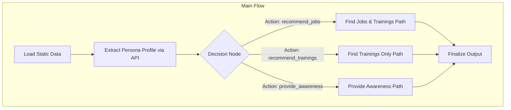

# Design Doc: Green Agents of Change Assistant (v2)

> Please DON'T remove notes for AI

## 1. Requirements

The primary goal is to build an AI-powered agentic system that interacts with simulated personas via an API. The system must efficiently extract a persona's profile through conversation, determine their needs, and provide personalized guidance on green jobs and learning opportunities in Brazil, formatted for an official submission.

### Core Functionality (Updated based on API Docs)

1.  **Converse and Extract Profile:** Interact with each persona via the `/chat` API to determine their age, location, education, experience, skills, and goals.
2.  **Recommend Jobs + Trainings:** For personas ready for employment, identify compatible jobs by applying **strict hard filters** (domain, location, education, etc.). Then, calculate skill coverage. For compatible jobs, recommend specific, sequential training programs to fill any skill gaps.
3.  **Recommend Trainings Only:** For personas focused on upskilling, recommend only the **immediate next level** of training based on their current skills and goals.
4.  **Provide Awareness Content:** For personas under 16, classify as `awareness` with the reason `"too_young"`. For personas just exploring, classify as `awareness` with the reason `"info"`.

## 2. Flow Design

### Applicable Design Pattern:

We will use a **Workflow** pattern. The initial node will be a small, rule-based **Agent** responsible for having a structured conversation to extract the persona's profile. This is critical for managing the API interaction limits and ensuring we get the data needed for the hard filters.

### Flow High-Level Design (Updated):

1.  **Load Static Data**: One-time setup step to load all job and training data from local markdown files.
2.  **Extract Persona Profile**: For a given `persona_id`, engage in a short, strategic conversation via the `/chat` API to build a structured profile.
3.  **Decision**: Analyze the extracted profile (especially age) to determine the path: `jobs+trainings`, `trainings_only`, or `awareness`.
4.  **Execution**: Branch to the appropriate path to perform matching and recommendation logic based on the hard filters.
5.  **Finalize**: Format the results into the required JSON structure.



## 3. Utility Functions (Updated)

1.  **`gdsc_utils` (`src/utils/gdsc_utils.py`) - CRITICAL**
    *   **Functions**: `aws_signed_request`, `chat_with_persona`.
    *   **Necessity**: This is now a core dependency provided by the competition organizers. It is the **only** way to communicate with the API for persona interaction and submission.

2.  **Data Retrieval (`src/utils/data_retrieval.py`)**
    *   `load_all_data(data_type)`: This is needed to load the jobs/trainings from local files.

3.  **Matching Rules (`src/utils/matching_rules.py`) - NEW**
    *   `apply_hard_filters(persona, job)`:
        *   **Input**: Structured persona profile, structured job data.
        *   **Output**: `boolean` (passes or fails).
        *   **Necessity**: To implement the mandatory matching rules from the API documentation.
    *   `get_required_trainings(persona, job)`:
        *   **Input**: Structured persona profile, structured job data.
        *   **Output**: List of required training recommendations.
        *   **Necessity**: To implement the skill-gap and training progression logic.

## 4. Data Design

### Shared Store (Updated)

The `persona_profile` is not loaded from a file but is built by the `ExtractProfileNode`.

```python
shared = {
    # Static data loaded once
    "all_jobs": [...],
    "all_trainings": [...],

    # Per-persona data
    "persona_id": "pers_001",
    "conversation_history": [
        {"role": "user", "content": "..."},
        {"role": "assistant", "content": "..."}
    ],
    "persona_profile": { # This is now BUILT by a node, not loaded
        "id": "pers_001",
        "age": 22,
        "education_level": "Graduação",
        "experience_years": 2,
        "skills": ["Marketing"],
        "city": "São Paulo",
        "is_open_to_relocate": false,
        "languages": ["Portuguese"],
        "target_domain": "Sustainability"
    },

    # Intermediate results
    "decision_action": "jobs+trainings",

    # Final structured output for submission
    "final_recommendation": { ... }
}
```

## 5. Node Design (Updated)

1.  **LoadStaticDataNode**
    *   **Purpose**: To load all job and training data into the shared store.
    *   **Status**: Unchanged.

2.  **ExtractProfileNode** - **NEW**
    *   **Purpose**: To manage the conversation with the persona API and extract a structured profile.
    *   **Type**: Regular, Agentic
    *   **Steps**:
        *   `prep`: Read `shared["persona_id"]`.
        *   `exec`:
            1.  Start a conversation with a generic greeting using `gdsc_utils.chat_with_persona`.
            2.  Ask a series of targeted questions to determine age, education, experience, skills, and goals.
            3.  Use an LLM call (`call_llm`) to parse the user's free-text responses into the structured `persona_profile` format.
            4.  Stop the conversation once all required fields are populated to conserve API interactions.
        *   `post`: Write the extracted `persona_profile` and the `conversation_history` to the shared store.

3.  **DecisionNode**
    *   **Purpose**: To analyze the extracted profile and decide the main path.
    *   **Status**: Logic is now more critical.
    *   **Steps**:
        *   `prep`: Read `shared["persona_profile"]`.
        *   `exec`:
            1.  Check `persona['age']`. If `< 16`, return `"provide_awareness_young"`.
            2.  Analyze persona's stated goals. If purely informational (e.g., "what is a green job?"), return `"provide_awareness_info"`.
            3.  If goals mention only learning/courses, return `"recommend_trainings"`.
            4.  Default to `"recommend_jobs"` for all other cases.
        *   `post`: Write the action to `shared["decision_action"]` and return it for flow control.

4.  **FindJobsAndTrainingsNode**
    *   **Purpose**: Implements the logic for job matching and training recommendations.
    *   **Status**: Logic is now defined by the hard filters.
    *   **Steps**:
        *   `prep`: Read `shared["persona_profile"]`, `shared["all_jobs"]`, `shared["all_trainings"]`.
        *   `exec`:
            1.  Iterate through `all_jobs` and apply the hard filters using the new `matching_rules.apply_hard_filters()` utility.
            2.  For jobs that pass, calculate skill coverage.
            3.  For each compatible job, use the `matching_rules.get_required_trainings()` utility to find trainings for skill gaps.
            4.  Structure the data for the final submission format.
        *   `post`: Write the result to `shared["final_recommendation"]`.