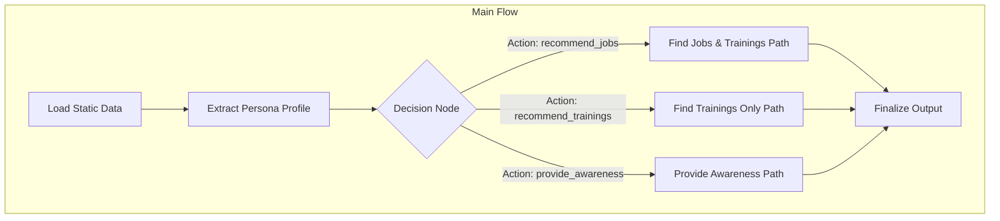

# Design Doc: Green Agents of Change Assistant (v3)

> Please DON'T remove notes for AI

## 1. Requirements

The primary goal is to build an AI-powered agentic system that interacts with simulated personas via an API. The system must efficiently extract a persona's profile through conversation, determine their needs, and provide personalized guidance on green jobs and learning opportunities in Brazil, formatted for an official submission.

### Core Functionality

1.  **Converse and Extract Profile:** Interact with each persona via the `/chat` API to determine their age, location, education, experience, skills, and goals.
2.  **Recommend Jobs + Trainings:** For personas ready for employment, identify compatible jobs by applying **strict hard filters**. For compatible jobs, recommend specific, sequential training programs to fill any skill gaps.
3.  **Recommend Trainings Only:** For personas focused on upskilling, recommend only the **immediate next level** of training based on their current skills and goals.
4.  **Provide Awareness Content:** For personas under 16, classify as `awareness` with the reason `"too_young"`. For personas just exploring, classify as `awareness` with the reason `"info"`.

## 2. Flow Design

### Applicable Design Pattern: Workflow + Agent

We will use a **Workflow** pattern. The workflow begins with an **Agentic Node** (`ExtractProfileNode`) that conducts a structured conversation to build a persona profile. This is followed by a rule-based decision node that routes the process to one of three specialized execution paths.

### Flow High-Level Design:

1.  **Load Static Data**: Load all job and training data from local files.
2.  **Extract Persona Profile**: Engage in a conversation via the `/chat` API to build a structured profile.
3.  **Decision**: Analyze the extracted profile to determine the path: `jobs+trainings`, `trainings_only`, or `awareness`.
4.  **Execution**: Branch to the appropriate path to perform matching and recommendation.
5.  **Finalize**: Format the results into the required submission structure.



## 3. Utility Functions

| Name | File Path | Status |
| :--- | :--- | :--- |
| **`call_llm`** | `src/utils/call_llm.py` | ✅ **Implemented** |
| **`gdsc_utils`** | `src/utils/gdsc_utils.py` | ✅ **Provided** |
| **`load_all_data`** | `src/utils/data_retrieval.py`| ✅ **Implemented** |
| **`matching_rules`** | `src/utils/matching_rules.py`| ✅ **Implemented** |

## 4. Data Design

### Shared Store

The `shared` store holds all data for a single persona's run through the flow.

```python
shared = {
    # Static data loaded once
    "all_jobs": [...],
    "all_trainings": [...],

    # Per-persona data
    "persona_id": "pers_001",
    "conversation_id": "...",
    "conversation_history": [...],
    "persona_profile": { # BUILT by ExtractProfileNode
        "id": "pers_001",
        "age": 21,
        # ... other extracted fields
    },

    # Intermediate results
    "decision_action": "recommend_jobs",
    "intermediate_recommendations": [...], # Output from a branch node

    # Final structured output for submission
    "final_recommendation": { ... }
}
```

## 5. Node Design

### 1. **LoadStaticDataNode**
*   **Purpose**: To load all job and training data into the shared store.
*   **Status**: ✅ **Implemented**

### 2. **ExtractProfileNode**
*   **Purpose**: To manage the conversation with the persona API and extract a structured profile.
*   **Status**: ✅ **Implemented**

### 3. **DecisionNode**
*   **Purpose**: To analyze the extracted profile and decide the main path.
*   **Status**: ⏳ **To Be Implemented**
*   **Type**: Regular
*   **Steps**:
    *   `prep`: Read `shared["persona_profile"]`.
    *   `exec`:
        1.  Check `persona['age']`. If `< 16`, return `"provide_awareness_young"`.
        2.  Analyze persona's stated goals. If purely informational, return `"provide_awareness_info"`.
        3.  If goals mention only learning/courses, return `"recommend_trainings"`.
        4.  Default to `"recommend_jobs"` for all other cases.
    *   `post`: Write the action string to `shared["decision_action"]` and return it for flow control.

### 4. Branch: **ProvideAwarenessNode**
*   **Purpose**: To format the awareness recommendation.
*   **Status**: ⏳ **To Be Implemented**
*   **Type**: Regular
*   **Steps**:
    *   `prep`: Read the specific action from `shared["decision_action"]`.
    *   `exec`: Based on the action (`_young` or `_info`), create a dictionary like `{"predicted_type": "awareness", "predicted_items": "too_young"}`.
    *   `post`: Write this dictionary to `shared["intermediate_recommendations"]`.

### 5. Branch: **FindTrainingsOnlyNode**
*   **Purpose**: To find and format training-only recommendations.
*   **Status**: ⏳ **To Be Implemented**
*   **Type**: Regular
*   **Steps**:
    *   `prep`: Read `shared["persona_profile"]` and `shared["all_trainings"]`.
    *   `exec`:
        1. Parse training data to identify skill and level for each program.
        2. Based on persona's skills, find the immediate next-level trainings.
        3. Format the output as `{"predicted_type": "trainings_only", "trainings": [...]}`.
    *   `post`: Write the result to `shared["intermediate_recommendations"]`.

### 6. Branch: **FindJobsAndTrainingsNode**
*   **Purpose**: To find jobs that pass hard filters and suggest trainings for skill gaps.
*   **Status**: ⏳ **To Be Implemented**
*   **Type**: Regular
*   **Steps**:
    *   `prep`: Read `shared["persona_profile"]`, `shared["all_jobs"]`, `shared["all_trainings"]`.
    *   `exec`:
        1.  Filter `all_jobs` using `matching_rules.apply_hard_filters()`.
        2.  For each passed job, call `matching_rules.get_required_trainings()`.
        3.  For each missing skill, find the corresponding training programs from `all_trainings`.
        4.  Structure the data into the final `jobs+trainings` format.
    *   `post`: Write the result to `shared["intermediate_recommendations"]`.

### 7. **FinalizeOutputNode**
*   **Purpose**: To ensure the final output matches the submission schema precisely.
*   **Status**: ⏳ **To Be Implemented**
*   **Type**: Regular
*   **Steps**:
    *   `prep`: Read `shared["persona_id"]` and `shared["intermediate_recommendations"]`.
    *   `exec`: Combine the `persona_id` with the recommendation payload into a single dictionary.
    *   `post`: Write the final, complete dictionary to `shared["final_recommendation"]`.

## 6. Orchestration Plan

### `flow.py`
*   **Purpose**: To define the main `Flow` object and connect all the nodes.
*   **Status**: ⏳ **To Be Implemented**
*   **Logic**:
    *   Instantiate all nodes.
    *   Create a linear chain: `LoadStaticDataNode >> ExtractProfileNode >> DecisionNode`.
    *   Implement conditional branching from `DecisionNode`:
        *   `DecisionNode - "recommend_jobs" >> FindJobsAndTrainingsNode >> FinalizeOutputNode`
        *   `DecisionNode - "recommend_trainings" >> FindTrainingsOnlyNode >> FinalizeOutputNode`
        *   `DecisionNode - "provide_awareness_young" >> ProvideAwarenessNode >> FinalizeOutputNode`
        *   `DecisionNode - "provide_awareness_info" >> ProvideAwarenessNode >> FinalizeOutputNode`

### `main.py`
*   **Purpose**: The main entry point to run the entire process for all personas.
*   **Status**: ⏳ **To Be Implemented**
*   **Logic**:
    1.  Create the flow from `flow.py`.
    2.  Generate a list of persona IDs (`persona_001` through `persona_100`).
    3.  Loop through each ID:
        *   Initialize a `shared` store with the current `persona_id`.
        *   Run the flow with the `shared` store.
        *   Append `shared["final_recommendation"]` to a master results list.
    4.  Save the master list to `submission.jsonl` in JSON Lines format.

---

This design document is now our definitive guide. We will proceed by implementing the `DecisionNode