# Pocket Flow

A [100-line](https://github.com/the-pocket/PocketFlow/blob/main/pocketflow/__init__.py) minimalist LLM framework for *Agents, Task Decomposition, RAG, etc*.

- **Lightweight**: Just the core graph abstraction in 100 lines. ZERO dependencies, and vendor lock-in.
- **Expressive**: Everything you love from larger frameworks—([Multi-](https://github.com/The-Pocket/PocketFlow/blob/main/docs/design_pattern/multi_agent.md))[Agents](https://github.com/The-Pocket/PocketFlow/blob/main/docs/design_pattern/agent.md), [Workflow](https://github.com/The-Pocket/PocketFlow/blob/main/docs/design_pattern/workflow.md), [RAG](https://github.com/The-Pocket/PocketFlow/blob/main/docs/design_pattern/rag.md), and more.  
- **Agentic-Coding**: Intuitive enough for AI agents to help humans build complex LLM applications.

## Core Abstraction

We model the LLM workflow as a **Graph + Shared Store**:

- [Node](https://github.com/The-Pocket/PocketFlow/blob/main/docs/core_abstraction/node.md) handles simple (LLM) tasks.
- [Flow](https://github.com/The-Pocket/PocketFlow/blob/main/docs/core_abstraction/flow.md) connects nodes through **Actions** (labeled edges).
- [Shared Store](https://github.com/The-Pocket/PocketFlow/blob/main/docs/core_abstraction/communication.md) enables communication between nodes within flows.
- [Batch](https://github.com/The-Pocket/PocketFlow/blob/main/docs/core_abstraction/batch.md) nodes/flows allow for data-intensive tasks.
- [Async](https://github.com/The-Pocket/PocketFlow/blob/main/docs/core_abstraction/async.md) nodes/flows allow waiting for asynchronous tasks.
- [(Advanced) Parallel](https://github.com/The-Pocket/PocketFlow/blob/main/docs/core_abstraction/parallel.md) nodes/flows handle I/O-bound tasks.


Here’s how you can represent each concept as a **separate Mermaid diagram**:

---

### **1. Node (Single Step)**


---

### **2. Flow (Multiple Steps)**


---

### **3. Batch (Repeat Steps)**


---

### **4. Parallel (Concurrent Steps)**

```mermaid
flowchart LR
    subgraph Parallel
        A1[Summarize Email]
        A2[Summarize Email]
        A3[Summarize Email]
    end
    A1 -->|→| Output
    A2 -->|→| Output
    A3 -->|→| Output
```


---

### **5. Async (I/O Wait)**


---

### **6. Looping (Long Running Step)**


---

### **7. Shared (Communication)**


---

### **8. Branch (Conditional Step)**


---

### **9. Nesting (Reusable Step)**

```mermaid
flowchart TD
    A[Coding Task] --> subgraph Reusable["Reusable Step"]
        B[Write Tests] --> C[Write Code]
        D[Analyze Complexity] --> E[Verify Code]
    end
```

---

## Design Pattern

From there, it’s easy to implement popular design patterns:

- [Agent](https://github.com/The-Pocket/PocketFlow/blob/main/docs/design_pattern/agent.md) autonomously makes decisions.
- [Workflow](https://github.com/The-Pocket/PocketFlow/blob/main/docs/design_pattern/workflow.md) chains multiple tasks into pipelines.
- [RAG](https://github.com/The-Pocket/PocketFlow/blob/main/docs/design_pattern/rag.md) integrates data retrieval with generation.
- [Map Reduce](https://github.com/The-Pocket/PocketFlow/blob/main/docs/design_pattern/mapreduce.md) splits data tasks into Map and Reduce steps.
- [Structured Output](https://github.com/The-Pocket/PocketFlow/blob/main/docs/design_pattern/structure.md) formats outputs consistently.
- [(Advanced) Multi-Agents](https://github.com/The-Pocket/PocketFlow/blob/main/docs/design_pattern/multi_agent.md) coordinate multiple agents.


# AI Workflow and Agent Patterns (Mermaid Diagrams)

This visualizes different orchestration and reasoning patterns using **Mermaid**.

---

## 🧭 Workflow (Directed Path)
```mermaid
flowchart LR
    A[Summarize Email] --> B[Draft Reply]
````

---

## 🧠 CoT (Chain-of-Thought)

```mermaid
flowchart LR
    A[Think] --> A
    A -.-> B[(Think History)]
```

---

## 🗺️ Map-Reduce (Batch + Merge)


---

## 💬 Chat (Looping + History Store)


---

## 📚 RAG (Retrieval-Augmented Generation)


---

## 🧩 Chat Memory (Looping + History + Vector DB)


---

## 🧑‍💼 Agent (Looping + Branching)


---

## 🤝 Multi-Agent (Loop + Branch + Pub/Sub)


---

## 🧱 Supervisor (Nesting)


---

## Utility Function

We **do not** provide built-in utilities. Instead, we offer *examples*—please *implement your own*:

- [LLM Wrapper](https://github.com/The-Pocket/PocketFlow/blob/main/docs/utility_function/llm.md)
- [Viz and Debug](https://github.com/The-Pocket/PocketFlow/blob/main/docs/utility_function/viz.md)
- [Web Search](https://github.com/The-Pocket/PocketFlow/blob/main/docs/utility_function/websearch.md)
- [Chunking](https://github.com/The-Pocket/PocketFlow/blob/main/docs/utility_function/chunking.md)
- [Embedding](https://github.com/The-Pocket/PocketFlow/blob/main/docs/utility_function/embedding.md)
- [Vector Databases](https://github.com/The-Pocket/PocketFlow/blob/main/docs/utility_function/vector.md)
- [Text-to-Speech](https://github.com/The-Pocket/PocketFlow/blob/main/docs/utility_function/text_to_speech.md)

**Why not built-in?**: I believe it's a *bad practice* for vendor-specific APIs in a general framework:
- *API Volatility*: Frequent changes lead to heavy maintenance for hardcoded APIs.
- *Flexibility*: You may want to switch vendors, use fine-tuned models, or run them locally.
- *Optimizations*: Prompt caching, batching, and streaming are easier without vendor lock-in.